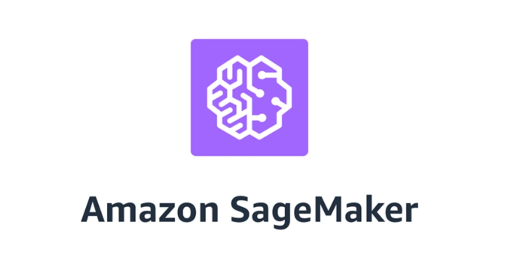
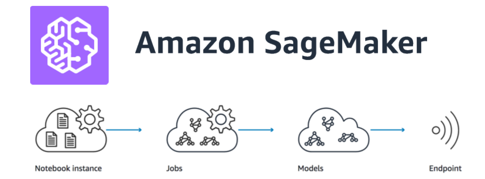
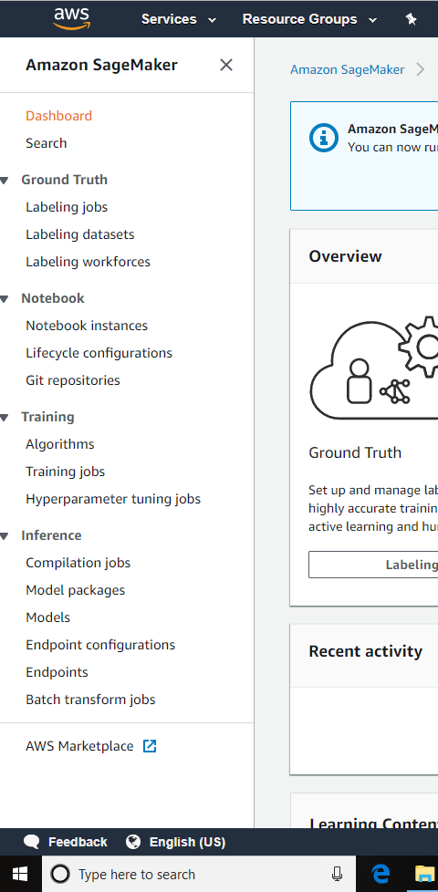
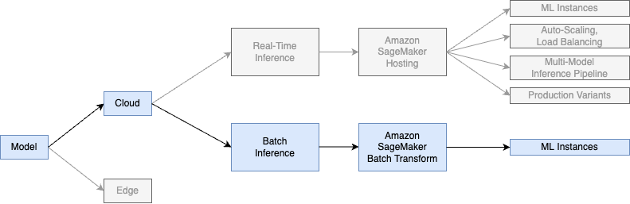

# Table of Contents

[Amazon Web Services - Introduction](#aws-intro)

[The AWS Ecosystem](#aws-ecosystem)

* Getting Started
    * Will This Cost Money?
    * Register Your Email
* The AWS Console
* A Note on Regions
    * AWS Regions
    * Implications for Your Projects
* AWS IAM
* Using the Amazon Resource Center

[Amazon Web Services - Recap (TL;DR)](#aws-recap)

* Key Takeaways

[Introduction to Amazon SageMaker](#sagemaker-intro)

* What is SageMaker?
* SageMaker Service Categories
    * Ground Truth
    * Notebooks
    * Training
    * Inference

[Data Science and Machine Learning Engineering](#ds-and-mle)

* Data Science vs. Machine Learning Engineering
* Deploying vs. Productionizing
* Generalization vs. Specialization

[Machine Learning Pipeline Creation Workflow](#ml-pipeline-workflow)

# Amazon Web Services - Introduction 

In this section, you'll be introduced to Amazon Web Services (AWS) - the most popular cloud service (with about a third of total market share as of Q2 2022). 

We'll begin this section by learning about all the ways that cloud computing services such as **_Amazon Web Services (AWS)_** have made things better and easier to "do data science". We'll also explore why being able to productionize the machine learning models you create so that other people can use them is an immensely valuable skill. 

One we understand the importance of cloud services and how they fit into the overall context of "doing data science", we'll jump right in to the most popular cloud service: AWS. We'll learn about what AWS ecosystem contains and how we can use it. We'll also create an account and learn our way around the AWS Management Console. 

Once we know the basics of AWS, we'll learn how we can make use of **_AWS SageMaker_**! Specifically, we'll see how we can incorporate AWS SageMaker into our workflow(s) to simplify things like distributed training or model productionization! 

Finally, we will train and ship a real-world model using AWS SageMaker. We'll start by training an XGBoost predictive model, then use batch transformation in AWS SageMaker to make it available for providing *inferences*. This will strongly enhance your ability to rapidly prototype ML solutions for your projects!

[Back to TOC](#toc)

# The AWS Ecosystem

Let's get set up to use **_Amazon Web Services_**, and then get to know our way around the platform!
 
<!--   -->
<!-- 
 -->
Specifically, this walkthrough is intended to help with the following:

- Set up an AWS account and explore the Amazon Resource Center 
- Explain what the "regions" are in AWS and why it is important to choose the right one
- Explain the purpose of AWS IAM

## Getting Started

Before we can begin exploring everything AWS has to offer, we'll need to create an account on the platform. To do this, start by following this link to [Amazon Web Services](https://aws.amazon.com/). 

### Will This Cost Money?

Although you will need a credit card to register for AWS, working through this section will not cost any money. AWS provides a free tier for learning and prototyping on the platform -- this is the tier we'll use for everything going forward. As long as you correctly register for the free tier, this will not cost you any money. 

### Register Your Email

Begin by clicking the "Sign Up" button in the top right-hand corner of the page. 

Next, create an account by adding your email and password. You'll also need to set an **_AWS Account Name_**. 

On the next screen, enter your contact information. **_Make sure you set your account type to 'Personal'!_** 

This next page is especially important -- be sure to select the **_Basic Plan_**! As a reminder, you will be asked to enter a credit card number during the next few steps. Although we will only be making use of the free tier of services for AWS, be aware that you will still need to enter a credit card number in order to complete the registration process. 

Now that you're all signed up, click the "Sign in to the Console" button to actually enter the AWS Console. 

Great, you've now created an AWS Account! Let's take a look around. 

## The AWS Console

Now that you're signed in, you'll see the **_AWS Console_**. This is your "home screen" for AWS -- it allows you to quickly navigate through the thousands of services offered on AWS to find what you need. The easiest way to find what you need is the "Find Services" search bar at the top of the body of the page. 

You can also click the "See All Services" dropdown to see a full list of services you can use in AWS. There are **a ton** of services, but don't let yourself get overwhelmed -- you'll probably never end up using the vast majority of these, as only a few apply to the work of a data scientist.

## A Note on Regions

### AWS Regions

AWS has data centers all over the world, and they are **not** interchangeable when it comes to your projects. Check out [this link](https://aws.amazon.com/about-aws/global-infrastructure/regions_az/) to see a list of all of the current AWS regions across the globe. While it typically won't matter for your projects in this program, the different AWS regions vary in terms of latency, cost, legal compliance, and features.

Each AWS region is a separate geographic area and is designed to be completely isolated from the other regions. This helps achieve the greatest possible fault-tolerance and stability. Communication between regions is possible, but often costs money and/or requires additional security configuration.

### Implications for Your Projects

It is **_very important_** that you always choose the same region to connect to with your projects. Resources are not automatically replicated across regions! One of the most common mistakes newcomers to AWS make is thinking they've lost their project because they are connected to a different data center and don't realize it. We'll remind you of this again later, but it can't hurt to say it twice: always make sure you're connected to the correct data center! This goes doubly for when you're creating a new project. 

## AWS IAM

IAM stands for [Identity and Access Management](https://aws.amazon.com/iam/). AWS allows IT administrators to configure access to different services at a very granular level, which can get intimidating pretty quickly!

Essentially all you need to know is that access to services requires you to create a **role** in IAM, and then set a **policy** for that role's access permissions. In some cases, e.g. you want to run a cloud notebook in [AWS SageMaker](https://docs.aws.amazon.com/sagemaker/latest/dg/security-iam.html), that role should be restricted to just you, and you should have permission to take any action. In other cases, e.g. you want to store data in an [S3 bucket](https://docs.aws.amazon.com/AmazonS3/latest/userguide/access-control-overview.html), you might want to allow anyone to download the data, but only allow yourself to upload.

In our curriculum examples we'll advise on IAM settings, but you'll likely need to do your own research as you explore beyond these for your own projects. Luckily these are public projects so the risk of leaking data or models is low. In a job setting, make sure you consult with your IT team to make sure that you are not revealing private data.

## Using the Amazon Resource Center

As platforms go, you won't find many with more options than AWS. It has an amazing amount of offerings, with more getting added all the time. While AWS is great for basic use cases like hosting a server or a website, it also has all kinds of different offerings in areas such as Databases, Machine Learning, Data Analytics and other areas useful to Data Scientists.

It's not possible for us to cover how to use every service in AWS in this section -- but luckily, we don't need to, because Amazon already has! The [Getting Started Resource Center](https://aws.amazon.com/getting-started/) contains a ton of awesome tutorials, demonstrations, and sample projects for just about everything you would ever want to know about any service on AWS. We **_strongly recommend_** bookmarking this page, as the tutorials they offer are very high quality, and free!

[Back to TOC](#toc)

# Amazon Web Services - Recap

## Key Takeaways

* AWS is a **_Cloud-Computing Platform_** which we can use for a variety of use cases in data science.
* In this section, we learned about how to sign up for AWS, and how to make sure that we have the right region selected when working in AWS.
* Amazon has centralized all of the major data science services inside **_Amazon SageMaker_**. SageMaker provides numerous services for things such as:
    * Data Labeling
    * Cloud-based Notebooks
    * Training and Model Tuning
    * Inference
<!-- * We can set up our own models, or use the preexisting models provided by AWS. Similarly, we can set up our own inference endpoints, or make use of preexisting endpoints created by AWS.  -->
<!-- * Creating our own endpoint requires us to use a Docker instance, as we saw in the previous codealong. Much of the work required to create an endpoint for our own model is boilerplate, and we can use it again and again across multiple projects.  -->

[Back to TOC](#toc)

# Introduction to Amazon SageMaker

Let's learn about **_Amazon SageMaker_**, and explore some of the common use cases it covers for data scientists! 

## What is SageMaker?

SageMaker is a platform created by Amazon to centralize all the various services related to data science and machine learning. You can get to SageMaker by just searching for "SageMaker" inside the spotlight search bar in the AWS Console. 

When you visit the page for SageMaker, you'll notice that the following graphic highlighting the various SageMaker service categories:

You'll also notice these same categories on the sidebar on the left side of the screen, with more detailed links to services that fall under each category:
 
 

Here's a brief explanation of how each of these services are used in the Data Science Process.

# SageMaker Service Categories

### Ground Truth

One of the hardest, most expensive, and most tedious parts of data science is getting the labels needed for supervised learning projects. For projects inside companies, it's quite common to start by gathering the proprietary data needed in order to train a model that can answer the business question and/or provide the service your company needs. One of the major use cases SageMaker provides is a well-structured way to manage data labeling projects. **_SageMaker GroundTruth_** allows you to manage private teams, in case your information is sensitive, or to manage public teams by leveraging **_AWS Mechanical Turk_**, which crowdsources labels from an army of public contractors that have signed up and are paid by the label. 

Recently, Amazon launched an automated labeling service that makes use of machine learning models to generate labels in a human-in-the-loop format, where only labels that are above a particular confidence threshold (which you set yourself) are auto-generated by the model. This allows your contractors to focus only on the tough examples, and saves you from having to pay as much for labels for the easy examples which a model can handle. 

### Notebooks

These are exactly what they sound like -- cloud-based Jupyter Notebooks!  SageMaker notebooks are just like regular Jupyter Notebooks, with a bit more added functionality. For instance, it's quite easy to choose from a bunch of pre-configured kernels to select which version of Python/TensorFlow/etc. you want to use. You can start a notebook from scratch inside SageMaker and do all of your work in the cloud, or you can upload preexisting notebooks into SageMaker, allowing you to do you work on a local machine and move it over to the cloud when you're ready for training!

We strongly recommend you take a minute to poke around inside a SageMaker interface to get a feel for it.

### Training

SageMaker's training services allow you to easily leverage cloud computing with AWS's specialized GPU and TPU servers, allowing you to train massive models that simply wouldn't be possible on a local machine. There are a ton of configuration options, and you can easily set budgets, limits, training times, and even auto-tune your hyperparameters! Although this is outside the scope of our lessons on AWS, Amazon provides some pretty amazing (and fast!) tutorials about how to use more specific services like cloud training or [model tuning](https://aws.amazon.com/blogs/aws/sagemaker-automatic-model-tuning/) once you've completed this section! 

### Inference

Arguably the most important part of the data science pipeline, **_Inference_** services focus on allowing you to create endpoints so that people can consume your models over the internet! One of the most handy parts of SageMaker's approach to inference is the fact that you can productionize your own model, or just use one of theirs! While there are certainly times where you'll need to create, train, and host your own model, AWS has made things simple by allowing you to use their own models and charging you on a per-use basis. For instance, let's say that you needed to make some time series forecasts. While you could go down the very complicated route of training your own model, you could also just make use of AWS SageMaker's *DeepAR* model, which uses the most cutting-edge time series model available to make forecasts on your data. 

These services and the overall scope of work that can be performed with them begins to blur the line between doing plain old data science and what's become increasingly known as *MLOps*. The following section will take a look at  these nuances in more detail.

[Back to TOC](#toc)

# Data Science and Machine Learning Engineering

This section is intended to help:

- Explain the difference between a Data Scientist and a Machine Learning Engineer
- Explain the difference between deploying models and productionizing models
- Highlight how the skills you're learning fit within the overall context of "doing data science"

## Data Scientist vs. Machine Learning Engineer

At large, established tech companies, data-related roles have specialized (e.g., Data Scientist, Machine Learning Engineer, etc.).

Data Scientists typically run experiments and train models until they have found a solution that works. Once they have trained and validated the model, they typically then hand off productionization of the model to **_Machine Learning Engineers_**. Whereas the Data Scientist creates the basic prototype, the Machine Learning Engineer's job is to put that model into a production system in a performant and maintainable manner. Whereas Data Scientists at large companies focus on the "big picture" by finding solutions to business problems, Machine Learning Engineers focus on the details, implementing the solutions created by the Data Scientists in the best way possible. Data Scientists focus more on analytics and statistics, whereas Machine Learning Engineers will have a stronger command of backend engineering, data structures and algorithms, and software engineering overall. The following diagram lays out the relationship between different technical roles well:

## Deploying vs. Productionizing

If we think back to the CRISP-DM process model, Deployment is the final step. We have previously discussed model pickling and how to ensure that data science processes are reproducible, as part of the deployment process:

So, if a Data Scientist toolkit already includes deployment, what additional skills and techniques play into the **productionizing** of models that Machine Learning Engineers perform?

There is no bright-line distinction between deploying and productionizing, but in general deploying focuses on the bare minimum to get a model into a context where it is usable for the client, whereas productionizing considers broader factors such as scaling, maintenance, and security. A deployed model might be manually re-trained on the latest data once a month, whereas a productionized model might be continuously re-training as new data comes in. Productionized models might also have test coverage, metric tracking, and [more](https://ml-ops.org/).

## Generalization vs. Specialization

**"Data Scientist" can mean many different things**. In some companies, it means a data analyst or a DBA focused on databases or data pipelines. In others, it means someone with a scientific mindset skilled with running A/B tests. Yet others may be highly specialized machine learning roles in areas like NLP, Computer Vision, or Deep Learning -- and these roles may break down further into specializations focused on either research or implementation. Specialized knowledge is accumalted over time; out of the gate, many early practitioners are **strong generalists**. The upside to being a strong generalist is possessing the capability of contributing to many different sorts of data science projects.

[Back to TOC](#toc)

# Machine Learning Pipeline Creation Workflow

Here's how we'll use our newly-acquired AWS knowledge to create an ML pipeline in the [next lesson](https://github.com/flatiron-school/DS-Deloitte-07062022-Architecting-Pipelines-with-AWS)!

[Source](https://www.coursera.org/lecture/ml-models-human-in-the-loop-pipelines/amazon-sagemaker-batch-transform-batch-inference-svDGb)
