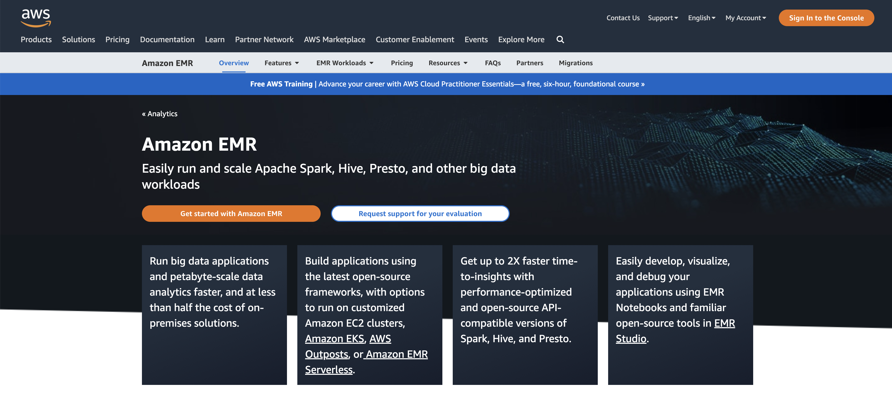
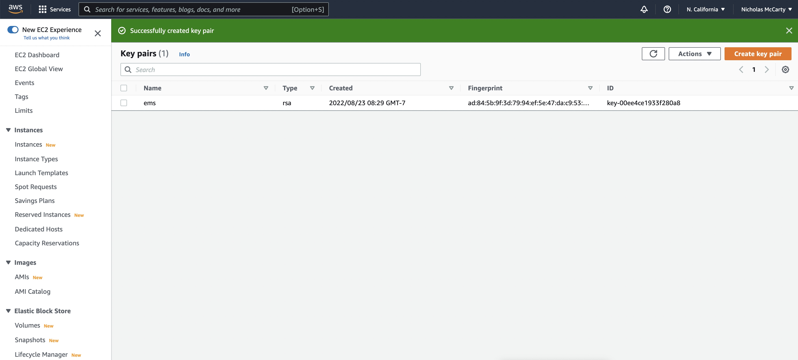
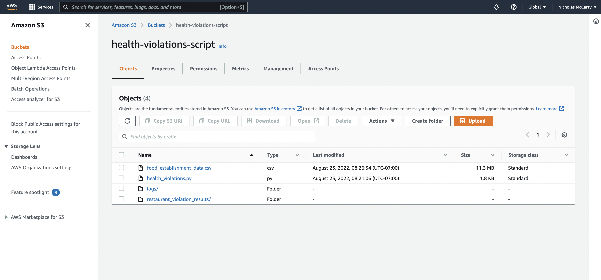
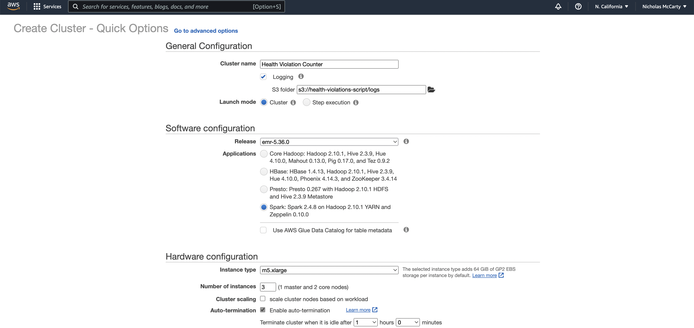
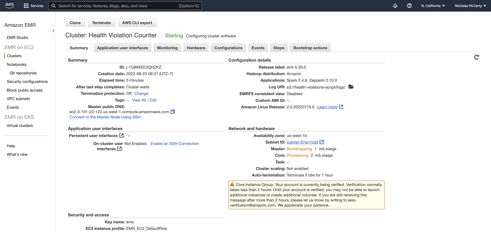

# Contents

* [Elastice MapReduce (EMR) Overview](#EMR-Overview)
* [Getting Started with AWS EMR](#Getting-Started)
    * [Create Key Pair for SSH](#Set-Up-an-EC2-Key-Pair-for-SSH)
    * [Create S3 Bucket](#Create-an-S3-Bucket)
    * [Set up EMR Cluster](#Set-up-and-Run-an-EMR-Cluster)
    * [Terminate Cluster](#Terminate-Cluster)
* [Inspect Results](#Inspect-Results)

# EMR Overview

<table width = "70%">
    <tr>
        <td>
             
        </td>
        <td>
            
        </td>
    </tr>
</table>

**Hadoop:** Hadoop got its start as a Yahoo project in 2006, which became a top-level Apache open-source project afterwards. It’s a general-purpose form of distributed processing that has several components: the Hadoop Distributed File System (HDFS), stores files in a Hadoop-native format and parallelizes them across a cluster; YARN, a schedule that coordinates application runtimes; and MapReduce, the algorithm that actually processes the data in parallel. Hadoop is built in Java, and accessible through many programming languages, for writing MapReduce code, including Python, through a Thrift client. 
It’s available either open-source through the Apache distribution, or through vendors such as Cloudera (the largest Hadoop vendor by size and scope), MapR, or HortonWorks. 

**Spark:** Spark is a newer project, initially developed in 2012, at the AMPLab at UC Berkeley. It’s a top-level Apache project focused on processing data in parallel across a cluster, but the biggest difference is that it works in memory. 

Whereas Hadoop reads and writes files to HDFS, Spark processes data in RAM using a concept known as an RDD, Resilient Distributed Dataset. Spark can run either in stand-alone mode, with a Hadoop cluster serving as the data source, or in conjunction with Mesos. In the latter scenario, the Mesos master replaces the Spark master or YARN for scheduling purposes. 
Spark is structured around Spark Core, the engine that drives the scheduling, optimizations, and RDD abstraction, as well as connects Spark to the correct filesystem (HDFS, S3, RDBMS, or Elasticsearch). There are several libraries that operate on top of Spark Core, including Spark SQL, which allows you to run SQL-like commands on distributed data sets, MLLib for machine learning, GraphX for graph problems, and streaming which allows for the input of continually streaming log data. 

Below is a table of differences between Spark and Hadoop: 

<table width = "70%">
  <thead>
    <tr>
      <th>Hadoop</th>
      <th>Spark</th>
    </tr>
  </thead>
  <tbody>
    <tr>
      <td>Hadoop is an open source framework which uses a MapReduce algorithm.</td>
      <td>Spark is lightning fast cluster computing technology, which extends the MapReduce model to efficiently use with more type of computations.</td>
    </tr>
    <tr>
      <td>Hadoop’s MapReduce model reads and writes from a disk, thus slow down the processing speed.</td>
      <td>Spark reduces the number of read/write cycles to disk and store intermediate data in-memory, hence faster-processing speed.</td>
    </tr>
    <tr>
      <td>Hadoop is designed to handle batch processing efficiently.</td>
      <td>Spark is designed to handle real-time data efficiently.</td>
    </tr>
    <tr>
      <td>Hadoop is a high latency computing framework, which does not have an interactive mode.</td>
      <td>Spark is a low latency computing and can process data interactively.</td>
    </tr>
    <tr>
      <td>With Hadoop MapReduce, a developer can only process data in batch mode only.</td>
      <td>Spark can process real-time data, from real time events like twitter, facebook.</td>
    </tr>
    <tr>
      <td>Hadoop is a cheaper option available while comparing it in terms of cost.</td>
      <td>Spark requires a lot of RAM to run in-memory, thus increasing the cluster and hence cost.</td>
    </tr>
    <tr>
      <td>The PageRank algorithm is used in Hadoop.</td>
      <td>Graph computation library called GraphX is used by Spark.</td>
    </tr>
  </tbody>
</table>

##### [Source](https://www.geeksforgeeks.org/difference-between-hadoop-and-spark/)

## AWS EMR Landing Page

## AWS EMR FAQs

## AWS EMR Use Cases

## AWS EMR Features and Benefits

For more info, check out the [AWS EMR page](https://aws.amazon.com/emr/?nc=sn&loc=0).

[Back to TOC](#Contents)

# Getting Started

##### [Source](https://docs.aws.amazon.com/emr/latest/ManagementGuide/emr-gs.html)

## Set Up an EC2 Key Pair for SSH

To get setup to run an EMR cluster in the cloud, you first have to [set up an EC2 key pair for SSH](https://docs.aws.amazon.com/emr/latest/ManagementGuide/emr-setting-up.html#emr-setting-up-key-pair). In other words, in order to authenticate and connect to the nodes in a cluster over a secure channel using the Secure Shell (SSH) protocol, you must create an Amazon Elastic Compute Cloud ([Amazon EC2](https://aws.amazon.com/ec2/)) key pair before you launch the cluster. You can also create a cluster without a key pair. This is usually done with transient clusters that start, run steps, and then terminate automatically.

Create a pair called `ems` to be called when setting up and running your EMR cluster:

**Hint:** *Click `Key Pairs` under `Resources`, then `Create New Pair`.*

The name `ems` is entered and all default values are kept before clicking the `Create key pair` button (again) in the example below:

Success!

## Create an S3 Bucket

**Note:** *You'll need to come up with a globally unique name for your S3 bucket, due to naming constraints. In other words, using the same name as seen in the tutorial won't work for you, unfortunately.*

Now we must create an S3 bucket, into which you'll upload the data source and [pySpark](https://spark.apache.org/docs/latest/api/python/getting_started/index.html) script:

Using the `Upload` button in the interface, the `csv` and `.py` files are added to the bucket called `health-violations-script`, whereas the `logs` and `restaurant_violation_results` folders are automatically added as an artifact of the EMR cluster running our script in the cloud:

## Set up and Run an EMR Cluster

So let's set up our cluster and run it!

You'll make a few changes from the default parameters:

1. Change the `S3 folder` path to include the name of the bucket you created with `/logs` appended to it, and
2. Select `Spark` from the list of `Applications` (see image below):

3. Select `ems` (or whatever you called the key pair you created at the beginning of the tutorial) from the `EC2 key pair` dropdown, as shown below:

**Note:** *The `m5.xlarge` instance type isn't available in all regions, so the next largest available size would need to be selected when using services in the `us-east-1` region, for example.*

If successful, you should see this:

Finally, you'll add a step by clicking the `Steps` tab at the top of your cluster interface in the console, and then clicking the blue `Add step` button. You'll then make a couple changes to the default parameters, as shown below:

**Note:** *Copy the `data_source` and `output_uri` (provided below) and paste them in as `Arguments`:*

`--data_source s3://DOC-EXAMPLE-BUCKET/food_establishment_data.csv` `--output_uri s3://DOC-EXAMPLE-BUCKET/myOutputFolder`

Additionaly, you'll need to copy and paste the following into the `Application Location` field:

`s3://health-violations-script/health_violations.py`

## Inspect Results

Assuming that your cluster ran successfully, you'll be able to access a `csv` file beginning with `part-` from the `restaurant_violation_results` folder in the S3 bucket you created for this tutorial:

## Terminate Cluster

Be sure to terminate your cluster by selecting your cluster in the console interface and clicking the `Terminate` button!

