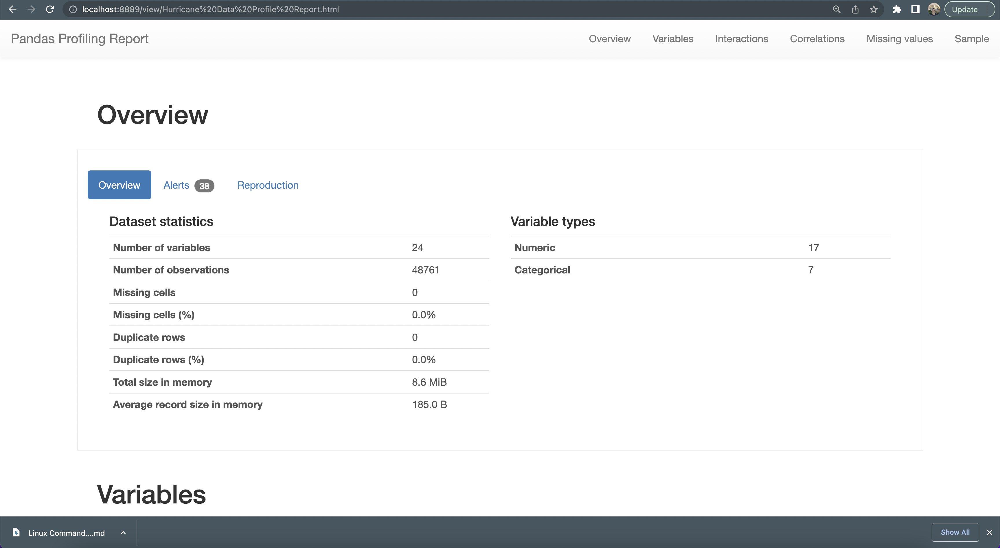
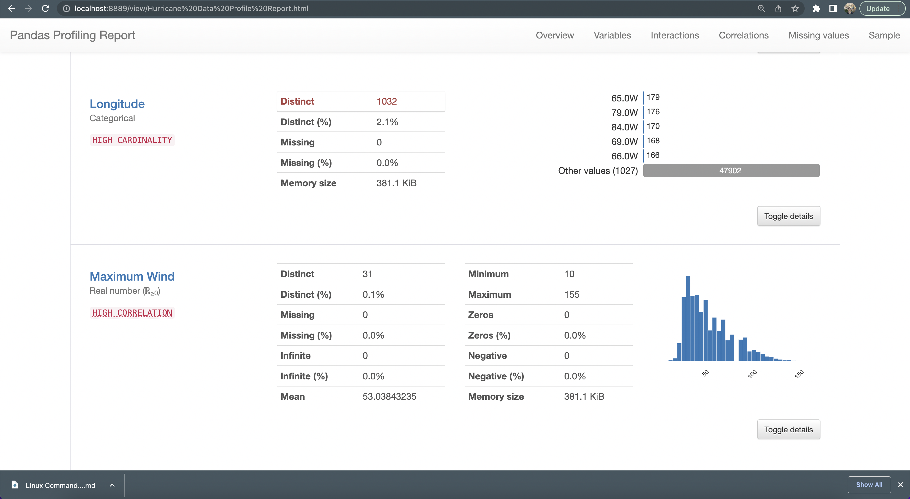

# Pandas Data Profiling

The [starter notebook](https://github.com/flatiron-school/DS-Deloitte-07062022/blob/main/supplemental/Pandas%20Data%20Profiling/Pandas%20Data%20Profiling.ipynb) is bloated with HTML and likely won't render for you here, so I'm providing an [alternative NBViewer link](https://nbviewer.org/github/flatiron-school/DS-Deloitte-07062022/blob/main/supplemental/Pandas%20Data%20Profiling/Pandas%20Data%20Profiling.ipynb) so you can preview the material (hint: it's worth it).

The fact that you can get such a quick overview of a given dataset is nothing short of amazing, so take ten minutes and learn something neat!

<table>
    <tr>
        <td>
             
        </td>
        <td>
            
        </td>
    </tr>
</table>
